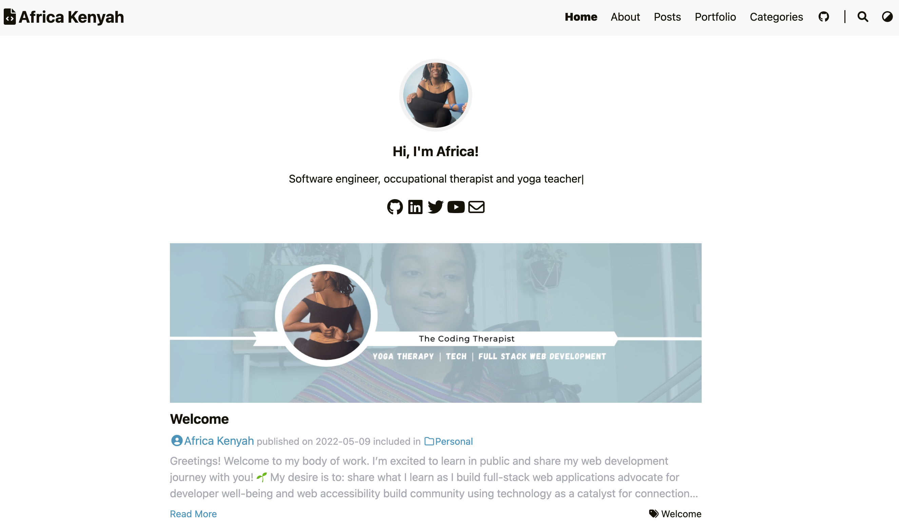
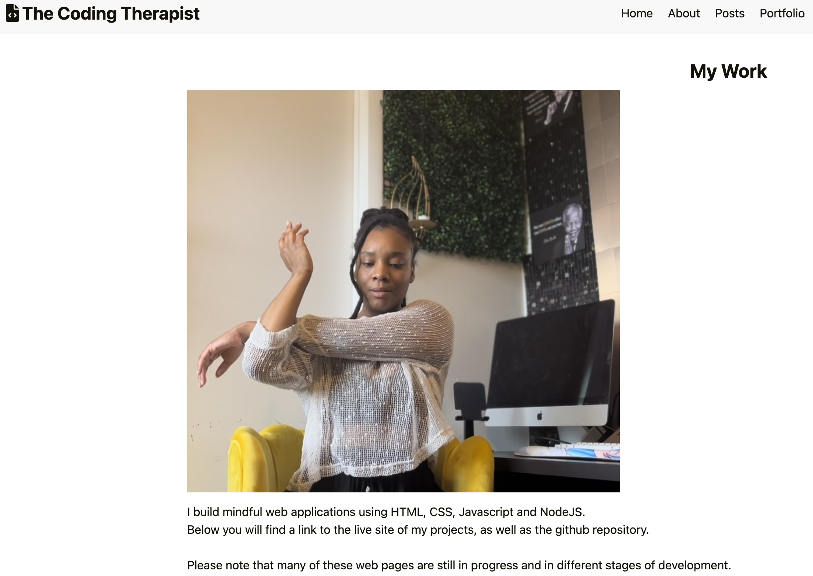
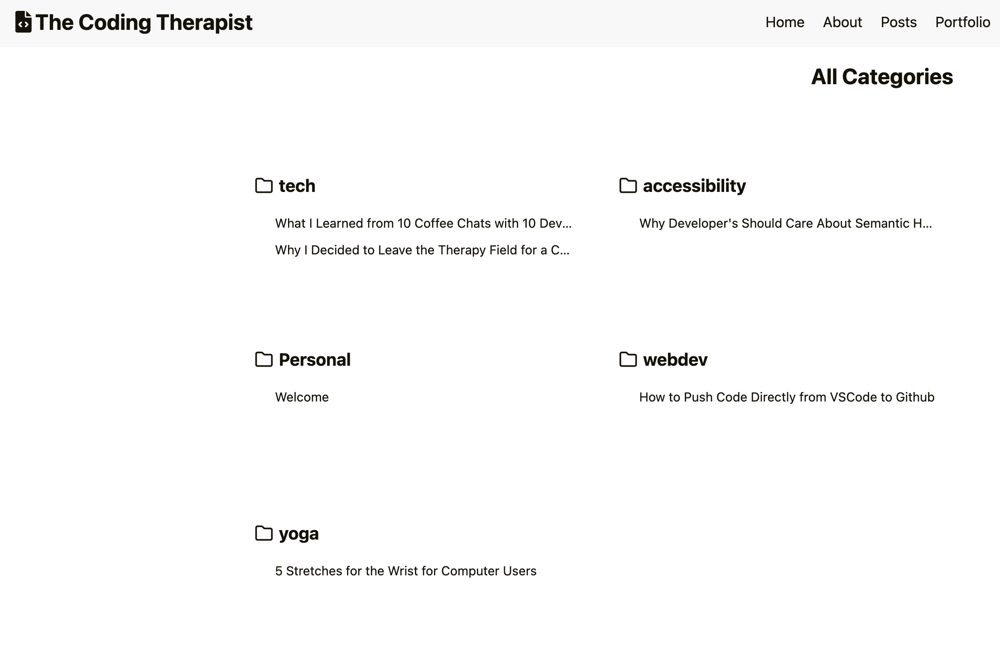

# The Coding Therapist Blog

A static blog page featuring posts, contact information, portfolio, tags and about me section. This site was built with Hugo using the loveit theme and hosted on Netlify.

Link to project: https://www.africakenyah.com/

## How It's Made:

Tech used: Hugo, GoLang

- Hugo framework used to construct and organize static markup pages for contact, about me, portfolio and blog posts pages

## Optimizations

To be added:

- placing images in cloud storage
- updating HTML for accessibility
- project links on portfolio page

## Lessons Learned:

- How to use canonical tags in markdown and SEO for repeated posts across platforms
- How to configure TOML and YOML files
- How to make favicons for webpage to display across site 
- Hugo file structure
